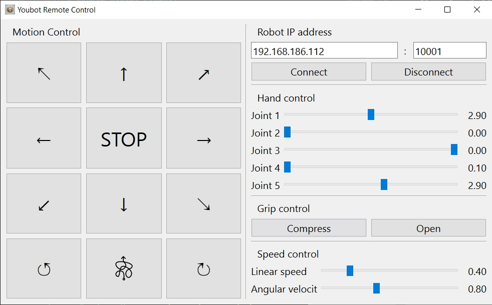

## Youbot Remote Control

Инструмент для управления роботом Kuka Youbot. Состоит из оконного приложения, написанного на [Qt](https://www.qt.io/), и [узла ROS](https://github.com/KirillHit/youbot_rc/tree/ros) для запуска на стороне робота. Для передачи команд используется протокол TCP.



### Конфигурация оборудования

Youbot:

* Ubuntu 16.04.7
* ROS Kinetic

Control PC:

* Windows 10
* Qt 5.15

### Подготовка

Информацию по настройки youbot можно найти [здесь](.docs\youbot_setup_instruction.pdf) или в репозитории [youbot](https://github.com/ut-ims-robotics/youbot/tree/kinetic).

Перед запуском драйвера необходимо выдать разрешение для youbot_driver_ros_interface на использование сетевых устройств. Подробнее [здесь](http://www.youbot-store.com/wiki/index.php/Execute_as_a_root).

### Запуск

Загрузка и сборка решения:

``` bash
$ mkdir -p ~/catkin_ws/src
$ cd ~/catkin_ws/src
$ git clone --branch ros --recursive https://github.com/KirillHit/youbot_rc.git
$ cd ~/catkin_ws
$ catkin_make
```

Далее необходимо запустить драйвер и сервер:

``` bash
# youbot driver
$ cd ~/catkin_ws
$ source devel/setup.bash
$ roslaunch youbot_driver_ros_interface youbot_driver.launch
```

``` bash
# tcp server
$ cd ~/catkin_ws
$ source devel/setup.bash
$ roslaunch youbot_rc start_server.launch
# possible to specify the port: port:=10002 (10001 default)
```

Теперь возможно подключиться к роботу через приложение. Для этого необходимо быть в одной сети с роботом и указать в приложении его ip адрес.


### Shortcuts
|Shortcut| Функция |
|:--:|:--|
| Q W E <br> A S D<br> Z X C | ↖ ↑ ↗ <br>← стоп → <br> ↙ ↓ ↘ |
| , | Поворот влево |
| . | Поворот вправо |
| P | Движение в случайном направлении |
| R | Сжать захват |
| F | Разжать захват |
| 1, 2, 3, 4, 5 | Вращение осей руки робота в положительном направлении |
| ctrl + 1 (2, 3, 4, 5) | Вращение в обратном направлении |

